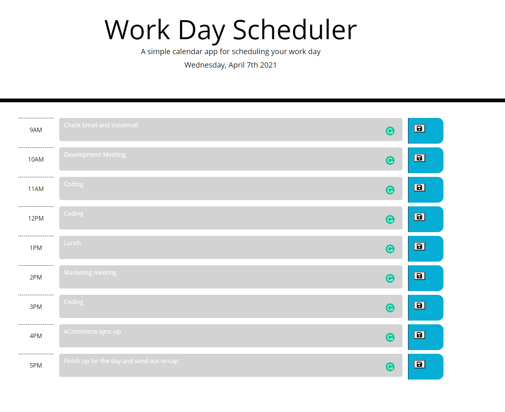

# Daily-Planner

This is a simple calendar application that allows a user to save events for each hour of the work day.

## Objectives

- This daily planner site will run in the browser and feature dynamically updated HTML and CSS powered by jQuery.  
- This planner will store the users schedule info on their local storage. 
- This site will also use Moment.js to display the date for this user.

## Execution

- Created an daily planner that lists out, in blocks, the hours of the work day.
- This planner allows the user to enter text into the each hour of the day to plan their day out.
- The current hr is highlighted for the user in red.
- The future hrs of the day are highlighted in green.
- The past hrs of the day are displayed in grey.
- The users text data is stored in the local storage so it does not disappear if the browser is refreshed. 

## Built With

## Screen Shots

